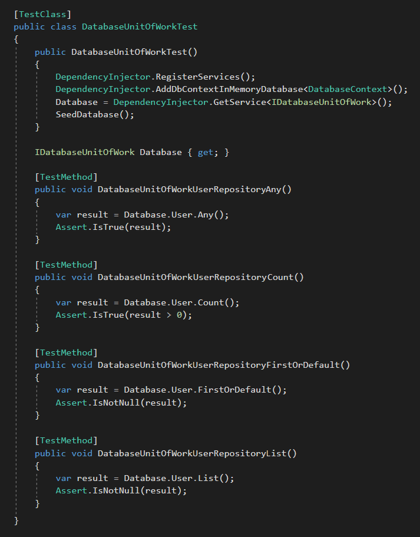
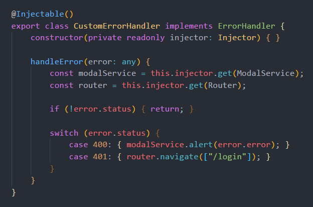
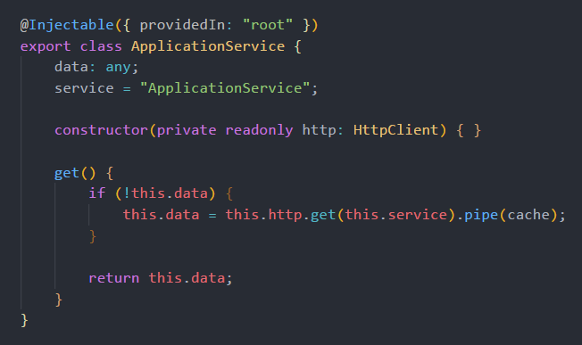
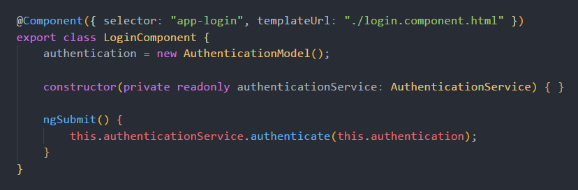
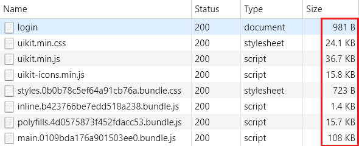

# DotNetArchitecture

   

## Best Practices and Technologies:

* Visual Studio 2017
* Visual Studio Code
* .NET Framework 4.7.1
* .NET Core 2.0
* C# 7.2
* ASP.NET Core 2.0
* Angular 5.2.10
* Typescript 2.7.2
* HTML5
* CSS3
* SASS (Syntactically Awesome Style Sheets)
* DDD (Domain-Driven Design)
* SOLID Principles
* Unit Test
* Unit of Work Pattern
* Repository Pattern
* Dependency Injection (Microsoft.Extensions.DependencyInjection)
* ORM - Object-Relational Mapping - Entity Framework Core 2.0 (Microsoft.EntityFrameworkCore)
* JWT - Json Web Token (Microsoft.IdentityModel.Tokens)
* Memory Caching (Microsoft.Extensions.Caching.Memory)
* Response Caching (Microsoft.AspNetCore.ResponseCaching)
* Object Mapping (AgileMapper)

## Code Analysis:

## Continuous Integration:

## Layers:

## Application:

## Repository:

## Unit Test:

## ASP.NET Core + Angular:

## ASP.NET Core Startup:

## ASP.NET Core Controller:

## Angular Guard:

## Angular Error Handler:

## Angular HTTP Interceptor:

## Angular Service with Cache:

## Angular Login Component:

## ASP.NET Core + Angular Initial Loading:

## ASP.NET Core + Angular + Entity Framework Core + SQL Server Performance:

## Visual Studio Extensions:

1. **CodeMaid**: https://marketplace.visualstudio.com/items?itemName=SteveCadwallader.CodeMaid

2. **SonarLint**: https://marketplace.visualstudio.com/items?itemName=SonarSource.SonarLintforVisualStudio2017

3. **TSLint**: https://marketplace.visualstudio.com/items?itemName=vladeck.TSLint

## Run in Visual Studio Code:

**NOTE:** If **Visual Studio 2017** is installed and the **packages** folder exists, go to **step 4**.

1. Install **SDKs** (.NET Core 2.x and .NET Framework 4.7.1):
https://www.microsoft.com/net/download/visual-studio-sdks

2. Download latest **nuget.exe** and copy to **Solution Folder**:
https://www.nuget.org/downloads

3. Open **Command Prompt** in **Solution Folder** and run **nuget restore**.

4. Install **C#** extension in **Visual Studio Code**.

5. Open **Solution Folder** in **Visual Studio Code**.

6. Press **F5**, run and fun!

## Publish and Run in IIS:

1. Install **NET Core 2.0 Windows Hosting**: https://aka.ms/dotnetcore-2-windowshosting.

2. Change the **SQL Server Database Connection String** in the **AppSettings.json** files.

3. Change the **base-href** variable in the **scripts** section in the **ClientApp\package.json** file:
	- "production": "--base-href=/**IIS_APPLICATION_NAME**/"

4. Publish ASP.NET Core Project in the Visual Studio.

5. Copy the published files to **IIS Directory** (inetpub\wwwroot\\**IIS_APPLICATION_NAME**).

6. In the **IIS**, create an **Application Pool** with **.NET CLR Version** = **No Managed Code**.

7. In the **IIS**, **Convert to Application** and use the **Application Pool** created in the previous step.

8. Run and fun!
