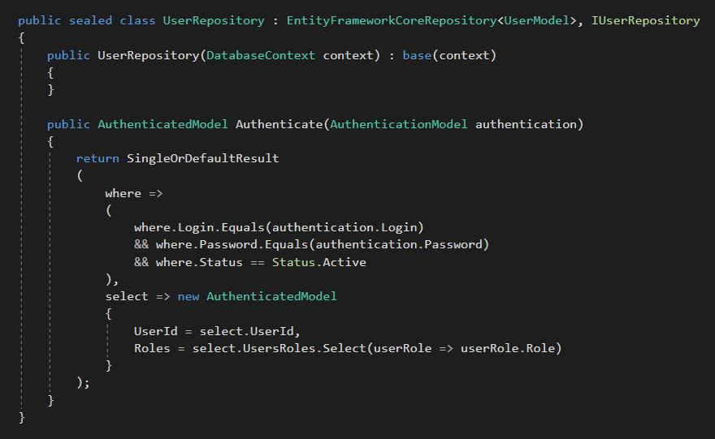
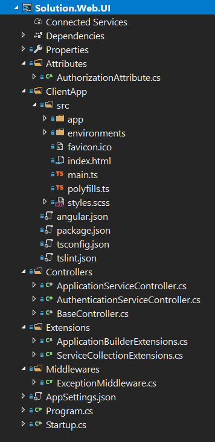
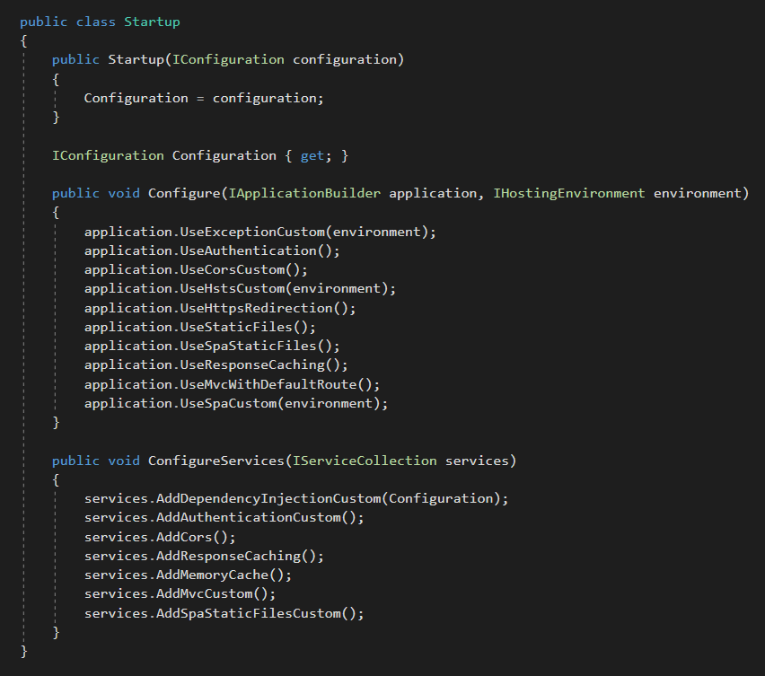
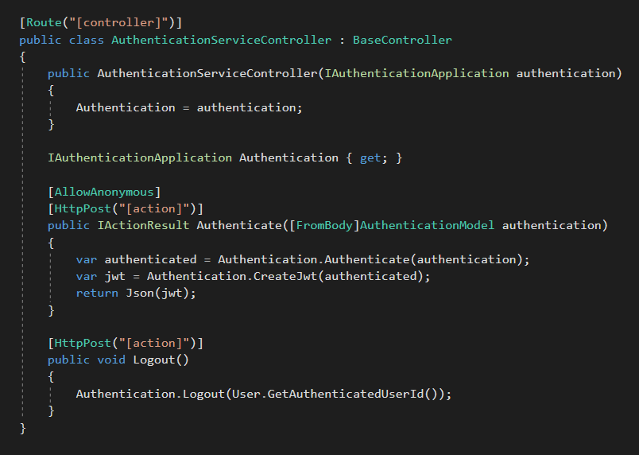
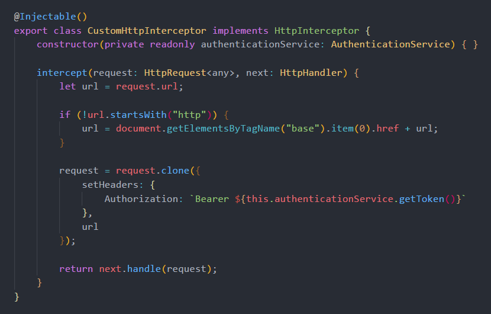

# DotNetArchitecture

* Cross-Platform (Windows, Linux, macOS)
* Visual Studio 2017
* Visual Studio Code
* .NET Core 2.1
* ASP.NET Core 2.1
* Entity Framework Core 2.1
* C# 7.2
* Angular 6.0.3
* Typescript 2.7.2
* HTML5
* CSS3
* SASS (Syntactically Awesome Style Sheets)
* DDD (Domain-Driven Design)
* SOLID Principles
* Dependency Injection
* Unit Test
* Unit of Work Pattern
* Repository Pattern
* JWT (Json Web Token)
* Memory Caching
* Response Caching
* Object Mapping
* Code Analysis (Ruleset for C# and TSLint for Typescript)

## Layers

## Application

## Repository

## Unit Test

## ASP.NET Core + Angular

## ASP.NET Core Startup

## ASP.NET Core Controller

## Angular Guard

## Angular Error Handler

## Angular HTTP Interceptor

## Angular Service

## Angular Component

## ASP.NET Core + Angular Initial Loading

## ASP.NET Core + Angular + Entity Framework Core + SQL Server Performance

**Specifications:**

**Processor:** Intel Core I7 8700K Coffee Lake 8th-generation.

**Memory:** 16GB 2400Mhz DDR4.

**Storage:** Samsung Evo 960 SSD M2 250gb.

## Visual Studio Extensions

**CodeMaid**: <https://marketplace.visualstudio.com/items?itemName=SteveCadwallader.CodeMaid>

**SonarLint**: <https://marketplace.visualstudio.com/items?itemName=SonarSource.SonarLintforVisualStudio2017>

**Roslynator**: <https://marketplace.visualstudio.com/items?itemName=josefpihrt.Roslynator2017>

**TSLint**: <https://marketplace.visualstudio.com/items?itemName=vladeck.TSLint>

## Run in Visual Studio Code

1. Install **.NET Core 2.1 SDK**: <https://www.microsoft.com/net/download/windows>.

2. Install **C#** extension in **Visual Studio Code**: <https://marketplace.visualstudio.com/items?itemName=ms-vscode.csharp>.

3. Open **solution folder** in **Visual Studio Code**.

4. Press **F5** to **run and fun**!

## Publish and Run in IIS

1. Install **.NET Core 2.1 Runtime**: <https://www.microsoft.com/net/download/windows>.

2. Change the **Connection String** in the **Solution.Web.UI\AppSettings.json**.

3. Change the **baseHref** value to **IIS_APPLICATION_NAME** in the **Solution.Web.UI\ClientApp\angular.json**.

4. Publish the **Solution.Web.UI** project in the **Visual Studio** or by **dotnet publish**.

5. Copy the published files to **IIS folder** (inetpub\wwwroot\\**IIS_APPLICATION_NAME**).

6. In the **IIS** create an **Application Pool** with **NET CLR Version** = **No Managed Code**.

7. In the **IIS** execute **Convert to Application** using the previously created **Application Pool**.

8. **Run and fun!**
